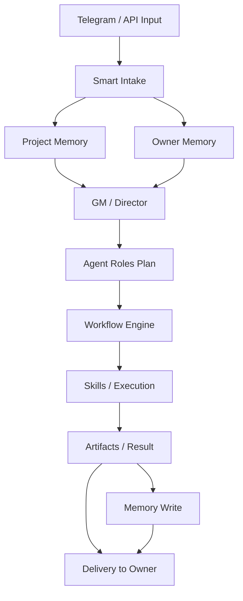

# NORTH STAR ARCHITECTURE

Статус: canonical reference v1  
Дата: 2026-04-14  
Назначение: единая карта AI Office System как целостной, управляемой архитектуры.

## 1) Суть системы

AI Office System — это управляемая система решения интеллектуальных и бизнес-задач в формате AI Team.

- Центр принятия решений: `Owner`.
- Основной интерфейс управления: `Telegram` (команда, approve, статус).
- Система работает не как «один ответ», а как контур: понять задачу, выбрать режим, выполнить безопасно, вернуть результат.
- Результаты работы: задачи (`Task`), решения (`Decision`/`Approval`), артефакты (файлы/отчёты), журнал событий (`AuditEvent`/`ExecutionEvent`).

Ключевой принцип: автономия допустима только внутри правил Owner, approve-гейтов и полной наблюдаемости.

## 2) Главная модель

Высокоуровневый путь:

`Input → Understanding → Context → Decision → Execution → Result → Memory`

- `Input`: вход владельца из Telegram/API.
- `Understanding`: Smart Intake нормализует намерение, confidence, решение по входу.
- `Context`: Project Memory и Owner Memory добавляют факты проекта и правила владельца.
- `Decision`: GM/Director выбирает режим (`quick|light|full`), действие и уровень риска.
- `Execution`: оркестрация (или workflow) запускает шаги через роли и навыки.
- `Result`: формируются summary, отчёт, файлы, статус задачи.
- `Memory`: фиксируются контекст, ключевые решения, итоги этапов.

## 3) Слои системы

### 1. Interface Layer
- Назначение: точка взаимодействия Owner с системой.
- Вход: сообщения/команды/approve.
- Выход: запрос на intake, owner-actions, статусы.
- Не входит: бизнес-решения и execution-логика.
- Код: `app/bot/`, `app/dashboard/`, `app/shared/auth.py`.

### 2. Smart Intake Layer
- Назначение: превратить сырой ввод в нормализованный `task_brief` и `decision`.
- Вход: `NormalizeIntakeRequest`.
- Выход: `NormalizeIntakeResponse`.
- Не входит: запуск pipeline/агентов.
- Код: `app/intake/`.

### 3. Project Memory Layer
- Назначение: дать контекст проекта и связанных задач.
- Вход: `project_id`, запрос, task context.
- Выход: `memory_bundle`/refs/snippets.
- Не входит: owner-policy.
- Код: `app/intake/memory_retriever.py`, `app/storage/models.py::MemoryEntry`.

### 4. Owner Memory Layer
- Назначение: применить правила/предпочтения Owner.
- Вход: owner profile + rules + overrides.
- Выход: rule effects (hard/soft), policy signal для approve.
- Не входит: выбор исполнителя и запуск шагов.
- Код: `app/owner_memory/`, `app/config/owner_memory_canon.yaml`.

### 5. GM / Director Layer
- Назначение: выбрать как работать системе для конкретного контекста.
- Вход: intake + memory + owner rules.
- Выход: `gm_decision` (mode/action/risk/agents/workflow_template).
- Не входит: фактическое выполнение шагов.
- Код: `app/gm_director.py`, `app/intake/schemas.py`.

### 6. Agent Roles Layer
- Назначение: определить роли в контуре выполнения (analyst/architect/executor/adapter/...)
- Вход: gm decision + triage/routing.
- Выход: role-aware sequence для выполнения.
- Не входит: низкоуровневые tool-вызовы.
- Код: `app/orchestrator/pipeline.py`, `app/orchestrator/roundtable.py`, `app/orchestrator/crewai_bridge.py`.

### 7. Agent Skills Layer
- Назначение: атомарные инструменты выполнения (документ, код, проверка, интеграции).
- Вход: шаг роли + payload шага.
- Выход: артефакт или структурированный результат шага.
- Не входит: глобальное планирование задачи.
- Код: `app/mcp_server/`, `app/runners/cursor_runner/`, bridge-инструменты в `app/orchestrator/`.

### 8. Workflow Layer
- Назначение: управляемые многошаговые цепочки с pause/resume и approve-гейтами.
- Вход: gm decision + template + task context.
- Выход: workflow status + step results + events.
- Не входит: «свободная автономия» и self-directed swarm.
- Код (канон расположения): `app/workflow/`.

### 9. Execution Layer
- Назначение: провести задачу до артефакта/статуса через оркестрацию.
- Вход: triage + routing + workflow/engine state.
- Выход: court summary, final status, artifacts.
- Не входит: авторизация интерфейса и owner UI.
- Код: `app/orchestrator/sync_run.py`, `app/orchestrator/*.py`.

### 10. Delivery Layer
- Назначение: донести Owner понятный результат и следующее действие.
- Вход: итог выполнения + статус + approvals.
- Выход: Telegram сообщение/кнопки/API response.
- Не входит: изменение task-plan.
- Код: `app/bot/handlers.py`, `app/bot/notify.py`, `app/dashboard/api_router.py`.

## 4) Поток данных (Data Flow)

`Telegram/API → Intake → Memory bundle → GM decision → Agent plan → Workflow/Orchestration → Skills/Execution → Result/Artifacts → Memory write → Delivery`

Где принимаются решения:
- Intake: `create|attach|clarify|reject`.
- Owner Rules: hard/soft policy effects.
- GM: `quick|light|full`, action, risk, template.
- Approval Gate: `waiting_owner` перед критическим шагом.

Зависимости:
- GM использует выходы Intake + Memory.
- Workflow/Execution следует решению GM, но не переопределяет owner-policy.
- Delivery зависит от финального статуса и approve-состояния.

## 5) Роль Owner (Control Center)

Owner — обязательный центр контроля системы.

Owner управляет через:
- approve-gates (`approve/rework/clarify`).
- override-правила (`/api/owner/overrides`).
- canonical rules (`owner_memory_canon.yaml`).
- канал команд (`Telegram`) и dashboard parity.

Система не имеет права действовать без Owner в критических зонах:
- внешние публикации,
- destructive/overwrite операции,
- deploy/infra-changes,
- strategy-shifts,
- действия, помеченные policy как critical.

## 6) Типы задач

- `quick`: быстрый ответ/уточнение без запуска полной оркестрации и без создания задачи при `action=answer|reject`.
- `light`: упрощённый путь выполнения, минимальный состав ролей.
- `full`: полный контур `triage → pipeline → roundtable → court`, с owner gate по рискам.
- `workflow`: управляемая многошаговая цепочка (template-driven), когда есть зависимости, pause/resume и контроль прогресса.

## 7) Workflow-система

Workflow = управляемый процесс, а не свободная автономия.

Канонические типы workflow:
- `research`
- `document`
- `execution_safe`
- `debug`
- `continuation`

Базовые статусы workflow:
- `created`, `planned`, `running`, `waiting_owner`, `paused`, `failed`, `done`, `cancelled`.

Статусы step:
- `pending`, `running`, `done`, `waiting_owner`, `failed`, `skipped`.

Обязательная семантика:
- при owner gate: workflow/step переходят в `waiting_owner`.
- resume происходит с последнего завершённого шага.
- каждое изменение состояния фиксируется в событиях.

## 8) Memory-модель

### Project Memory
- Что хранится: знания по проекту, релевантные исторические факты, snippets.
- Где: `memory_entries` (`scope=project/...`).
- Зачем: повышать точность решения в intake/plan.

### Owner Memory
- Что хранится: rules, preferences, priorities, overrides.
- Где: `owner_profiles`, `owner_memory_items`, `owner_overrides`.
- Зачем: policy-контур и owner-intent consistency.

### Operational Memory
- Что хранится: run/workflow state, execution events, audit trail.
- Где: `runs`, `execution_events`, `audit_events`.
- Зачем: наблюдаемость, recovery, разбор инцидентов.

### Artifact Memory
- Что хранится: пути и summary по артефактам, handoff-пакеты.
- Где: `tasks.report_path`, `handoffs`, `app/artifacts/`.
- Зачем: воспроизводимость результата и owner visibility.

## 9) Ограничения системы

Система явно НЕ делает:
- unrestricted autonomy,
- скрытый execution без логов,
- критические действия без owner контроля,
- self-modifying orchestration,
- рекурсивные автономные workflow по всем проектам,
- дублирование независимых orchestration engines.

## 10) Принципы развития

1. Не ломать рабочий pipeline: backward compatibility до завершения миграции.
2. Не дублировать orchestration и source of truth.
3. Сначала фиксировать канон (docs/contracts), затем расширять реализацию.
4. Идти от простого к сложному: template-first, потом adaptive planning.
5. Избегать overengineering: только проверяемые и наблюдаемые шаги.
6. Любая новая автономия должна иметь owner visibility, gate semantics и audit.

## Визуальная схема

```text
[Telegram/API]
   ↓
[Smart Intake]
   ↓
[Project + Owner Memory]
   ↓
[GM / Director]
   ↓
[Agent Roles]
   ↓
[Workflow Engine / Orchestration]
   ↓
[Skills / Execution]
   ↓
[Artifacts + Status]
   ↓
[Memory Write + Delivery]
```

## Mermaid-схема



## Code Map (слой → путь)

- Interface: `app/bot/`, `app/dashboard/`
- Smart Intake: `app/intake/`
- Project Memory: `app/intake/memory_retriever.py`, `app/storage/models.py`
- Owner Memory: `app/owner_memory/`, `app/config/owner_memory_canon.yaml`
- GM/Director: `app/gm_director.py`
- Agent Roles: `app/orchestrator/pipeline.py`, `app/orchestrator/roundtable.py`, `app/orchestrator/crewai_bridge.py`
- Agent Skills: `app/mcp_server/`, `app/runners/cursor_runner/`
- Workflow: `app/workflow/` (канонический модуль для workflow engine)
- Execution: `app/orchestrator/sync_run.py`, `app/orchestrator/`
- Delivery: `app/bot/notify.py`, `app/bot/handlers.py`, `app/dashboard/api_router.py`
